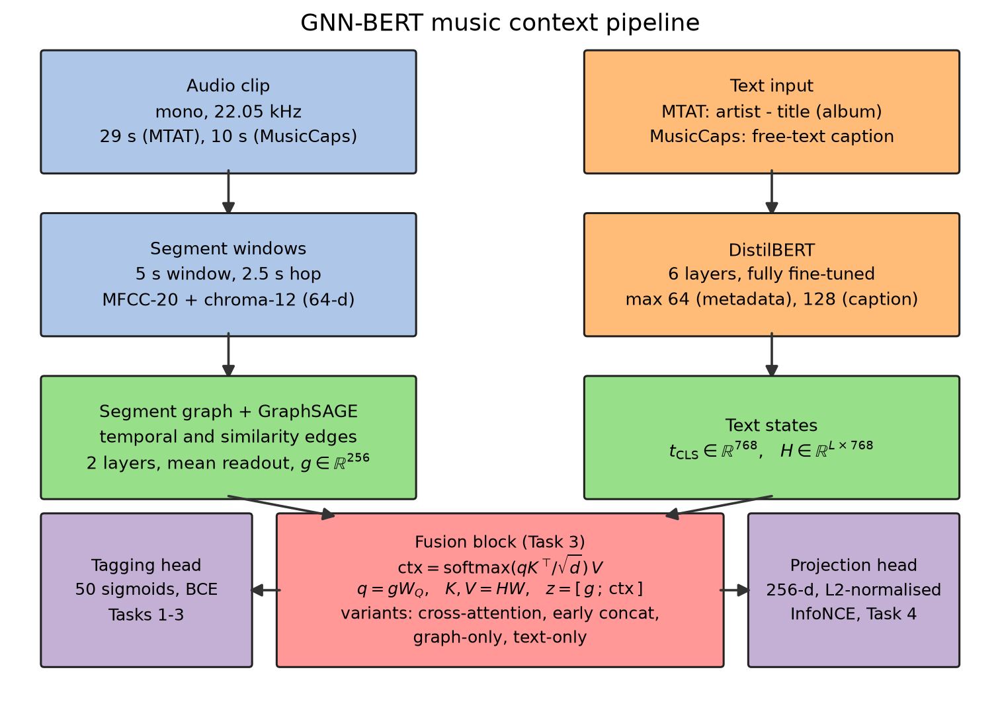
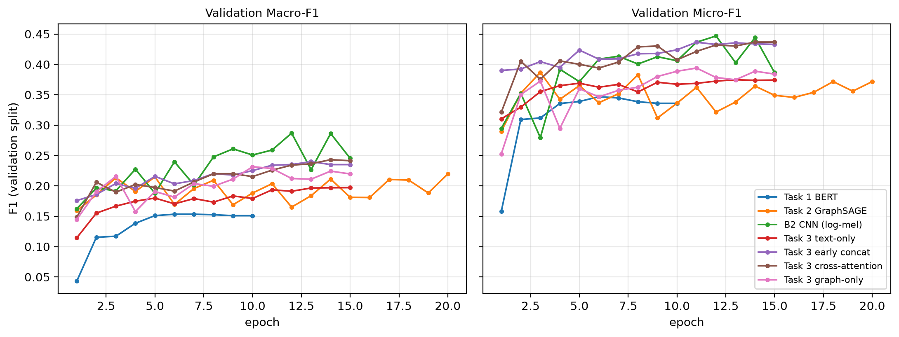
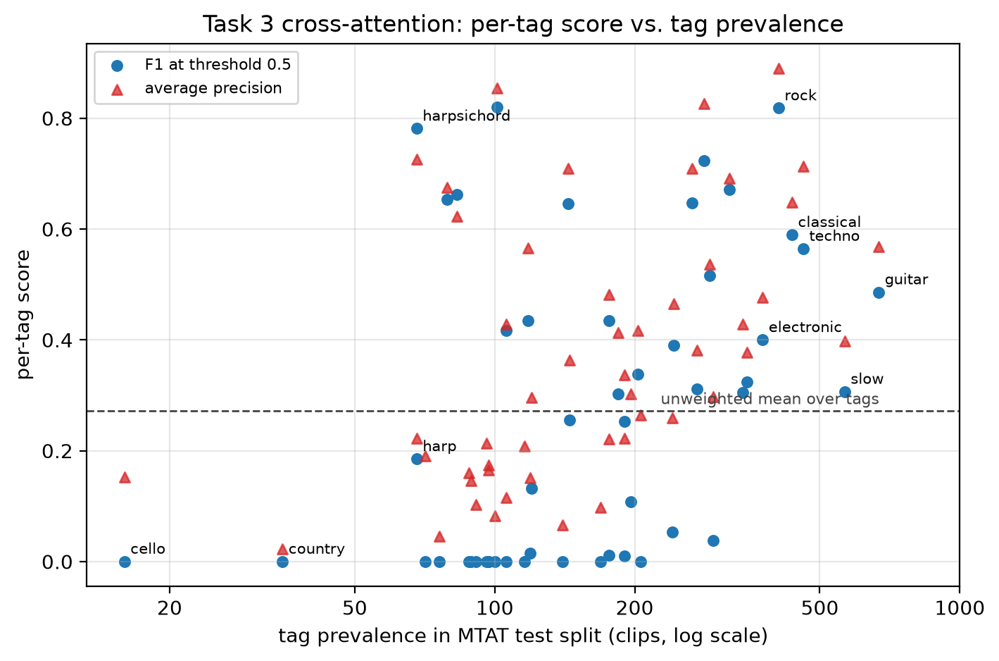
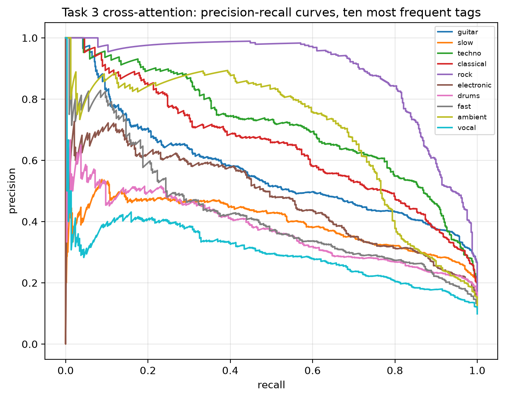
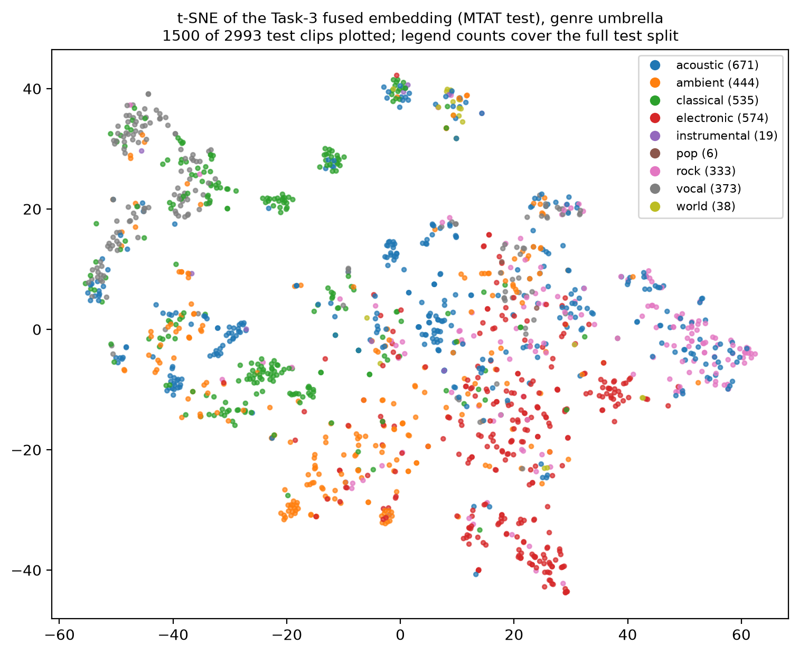
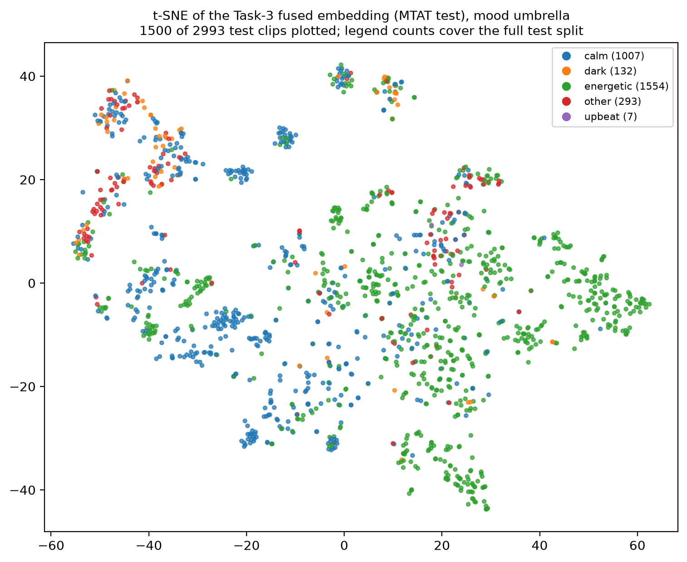

# GNN–BERT Fusion for Music Context Understanding

## Abstract

This work asks whether a graph representation of audio structure, combined with
a pretrained language model, improves music context understanding. Each audio
clip becomes a *segment graph* encoded by GraphSAGE, and the accompanying text
(tag metadata or a free-text caption) is encoded by DistilBERT. Four tasks are
evaluated on MagnaTagATune (MTAT) and MusicCaps: text-only tagging, graph-only
tagging, graph–text fusion with ablations, and contrastive audio–caption
retrieval. On MTAT top-50 tagging, both fusion variants beat their unimodal
ablations (early concatenation Macro-F1 0.278, cross-attention 0.272, against
0.217 for the text-only ablation and 0.242 for the graph-only ablation), and the
contrastive model reaches Caption→Audio R@10 of 21.9%, roughly twelve times
chance, with a zero-shot tag Macro-F1 of 0.164. Every model beats a
prior-matched random baseline at 0.066. The analysis also reports where the
design falls short: cross-attention buys nothing over concatenation, a band of
rarer tags is never predicted above threshold at all, and the similarity-edge
rule saturates its own degree cap on every MTAT graph. Code and reproducible
artifacts accompany the report.

## 1. Introduction

Music understanding sits between audio signal processing and natural language.
A piece has acoustic structure (repetition, contrast, texture) and describable
semantics (genre, instrumentation, mood), and most tagging systems model only
the first of these. Convolutional models on mel-spectrograms remain the standard
approach on MagnaTagATune, and they treat a clip as an undifferentiated image of
time and frequency.

A segment graph makes a different assumption. Cutting a clip into overlapping
windows and connecting windows that resemble each other turns repetition and
return into an explicit edge rather than something a convolution has to
rediscover from pixels. The question this project tests is whether that
structure, once fused with a language model, adds anything a spectrogram model
does not already provide.

The four tasks in the project specification are implemented end to end:
text-only tagging, graph-only tagging, graph–text fusion with a four-way
ablation, and contrastive audio–caption retrieval, each measured against three
baselines on a fixed split with a fixed seed. Where a design choice could have
gone either way, the report gives the measurement behind it, including two cases
where the measurement showed the choice was doing nothing.

## 2. Related Work

Automatic music tagging on MTAT has been dominated by convolutional
architectures on time–frequency inputs since Choi et al. (2016), and Won et al.
(2020) gives the comparison of those models under a shared folder split, which
is the split convention this project follows. Graph neural networks enter music
information retrieval mainly through symbolic representations such as chord or
score graphs; applying GraphSAGE to audio-derived segment nodes, as here, trades
spectral detail for an explicit encoding of self-similarity.

On the language side, the contrastive image–text objective of CLIP transfers
to audio through models such as CLAP, which pairs an audio encoder with a text
encoder under InfoNCE. Task 4 applies the same objective with a graph encoder in
place of the audio encoder, at a data scale roughly three orders of magnitude
smaller than CLAP's, which is the context for the retrieval numbers reported
later.

## 3. Method

**Segment graphs.** Each clip is resampled to 22.05 kHz mono and cut into 5 s
windows with a 2.5 s hop. Each window becomes one node carrying a 64-dimensional
vector: MFCC-20 and chroma-12, each summarised by mean and standard deviation
over the window. Edges come in two kinds. Temporal edges connect adjacent
windows in both directions. Similarity edges connect non-adjacent windows whose
node features have cosine similarity above τ = 0.6, capped at 4 extra edges per
node and weighted by the similarity value.

The 5 s window is long enough to contain a phrase or a bar group at common
tempos, and short enough that a 29 s MTAT clip yields 11 nodes rather than 3 or
4; the 2.5 s hop gives each node a half-window
overlap with its neighbour, so a musical event falling on a window boundary
still lands inside some node. The value τ = 0.6 was chosen to keep only clearly
related window pairs, and the degree cap of 4 was meant as a guard against dense
graphs on repetitive material.

Measuring the built graphs shows the cap does all the work. Every MTAT graph has
exactly 11 nodes, 20 temporal edges and 44 similarity edges, which is 4 per node
on all 21,108 graphs. The cap binds everywhere, so the operative rule is "each
window connects to its four most similar non-adjacent windows" and τ never
rejects anything on this corpus. Raising τ would start to matter; at 0.6 it is
inert. MusicCaps graphs have the opposite problem: a 10 s clip yields 3 nodes
(occasionally 4), only one non-adjacent pair exists, and 99.5% of those graphs
carry a similarity edge. Section 5 returns to what that does to the case-study
evidence.

**Encoders.** The graph encoder is a 2-layer GraphSAGE (PyTorch Geometric) with
mean readout, producing a 256-dimensional graph embedding *g*. Two layers give
each node a receptive field of two hops, which on an 11-node graph already
reaches most of the clip; deeper stacks oversmooth on graphs this small. Text is
encoded by a fully fine-tuned DistilBERT, keeping both the CLS embedding
*t*_CLS and the token sequence *H*. DistilBERT rather than BERT-base because the
4 GB GPU used for every run has to hold the language model, the graph encoder
and the fusion head at once.

**Fusion (Task 3).** The main fusion is single-head cross-attention with the
graph readout as query and projected BERT tokens as keys and values,
ctx = softmax(qKᵀ/√d)V with q = gW_Q and K, V = HW, classified from
z = [g ; ctx] through an MLP with sigmoid outputs under binary cross-entropy.
Three ablations share the same head and training schedule: early concatenation
(z = [g ; t_CLS]), text-only (z = t_CLS), and graph-only (z = g). Holding the
head and schedule fixed is what makes the four numbers comparable; the only
thing that changes between them is which representation reaches the classifier.

**Contrastive retrieval (Task 4).** A dual encoder maps graphs and captions into
a shared 256-dimensional L2-normalised space, trained with symmetric InfoNCE at
temperature 0.07, with each branch warm-started from the Task-1 and Task-2
checkpoints. Warm-starting matters at this data scale: 4,817 training pairs are
far too few to learn an audio encoder and a text encoder from scratch, so the
contrastive stage aligns two encoders that already work rather than building
them. Negatives are the other captions and graphs in the same mini-batch, with
no memory bank and no hard-negative mining, so negative difficulty is bounded by
the effective batch size of 64. This is the main structural gap against CLAP,
which trains with far larger negative sets.

*Figure 1: Pipeline. The left column turns a clip into a segment graph encoded
by GraphSAGE; the right column encodes metadata or a caption with DistilBERT.
The two meet in the fusion block, which feeds a 50-way sigmoid tagging head for
Tasks 1–3 and a projection head trained with InfoNCE for Task 4. The four
Task-3 variants are settings of the same fusion block, not separate paths.*

## 4. Experimental Setup

### 4.1 Datasets and label vocabulary

**MagnaTagATune** supplies 25,863 annotated clips of 29 s each, labelled from a
vocabulary of 188 tags. MTAT carries no lyrics or captions, so the Task-1 text
input is the clip metadata string `artist - title (album)`. **MusicCaps**
supplies 10 s clips with expert free-text captions. YouTube blocks automated
downloads of the original audio, so the audio comes from the public
`CLAPv2/MusicCaps` mirror, giving 5,352 clips split 90/10 with seed 42. All runs
use seed 42.

Following the project specification and the tagging literature, MTAT is
restricted to its 50 most frequent tags. That discards 138 of the 188 tags, so
Table 1 sets out what the restriction keeps and what it throws away.

*Table 1: What restricting MTAT to its 50 most frequent tags costs. Counts are
over the 25,863 annotated clips in the released annotation file.*

| Quantity | Value |
|---|---:|
| Tags in the released vocabulary | 188 |
| Positive tag assignments in total | 89,395 |
| Assignments carried by the top 50 tags | 69,714 (78.0%) |
| Assignments in the discarded 138-tag tail | 19,681 (22.0%) |
| Clips with at least one tag | 21,642 |
| Clips that keep at least one top-50 tag | 21,111 |
| Clips that lose their entire label vector | 531 (2.5%) |
| Tags occurring on fewer than 100 clips | 67 |
| Mean top-50 tags per retained clip | 3.30 |

The discarded tail is largely redundant rather than novel. Fourteen of the
dropped tags are spelling or inflection variants of retained ones: `electro` and
`electronica` against `electronic`, `drum` against `drums`, `violins` against
`violin`, `male vocals` against `male vocal`, and `harpsicord` and `clasical` as
outright misspellings. Those fourteen carry 3,646 of the discarded assignments,
and on 68% of the clips holding them the canonical retained tag is already
present, so dropping them removes nothing from those clips.

The tail is also sparse enough that supervised learning on it would measure
noise. The median discarded tag appears on 100 of 25,863 clips, a prevalence of
0.39%. Under a fixed sigmoid threshold, a classifier for a tag that rare reaches
near-perfect accuracy by always predicting zero, and its F1 is either 0 or a
value decided by a handful of clips.

Macro-F1 makes that a problem for the headline number, because it weights every
tag equally. Keeping all 188 tags would let 138 near-degenerate columns
determine roughly three quarters of the reported score, which would then
describe the annotation tail more than the model. Against that, the restriction
costs 531 clips out of 21,642, which is a price worth paying.

The cut does lose genre coverage at the margins. `jazz` (439 clips), `baroque`
(297) and `folk` (243) fall outside the top 50 despite naming genres no retained
tag covers, so the label space skews toward instrument and mood descriptors. The
t-SNE umbrellas in Section 5 inherit that skew.

### 4.2 Data splits

The 25,863 annotated MTAT clips are not 25,863 independent pieces of music. They
are excerpts of 6,446 distinct recordings, averaging 4.87 excerpts per recording
across the full clip table. A uniform random clip-level split would place, for a
typical test excerpt, roughly four other excerpts of the same performance by the
same artist into the training set, and a model could then score well by
recognising the recording instead of reading the music.

MTAT ships its audio in 16 directories named `0`-`9` and `a`-`f`, and the
directory prefix in each clip's path is derived from artist, album and track, so
a recording's excerpts almost always share a directory. Splitting on directories
therefore splits on recordings. Assigning `0`-`c` to training, `d` to
validation, and `e`-`f` to test gives 16,779 / 1,339 / 2,993 clips and leaves 11
of 6,446 recordings straddling the train-test boundary, with 3 straddling
train-validation. That residue is small enough to ignore. This assignment puts
one more directory in training than the 12/1/3 partition of Won et al. (2020),
so the absolute numbers here are not directly comparable to that paper's.

Artist-level leakage survives. Of the 56 artists appearing in the test
directories, 36 also appear in training, covering 64% of test clips. MTAT draws
from a catalogue of only 270 artists, so any split of it leaks artist identity
unless artists are partitioned explicitly, which would shrink and unbalance the
test set. Every number in Table 2 should be read as same-artist,
unseen-recording performance rather than fully out-of-distribution performance.

### 4.3 Training

DistilBERT is fine-tuned at learning rate 2×10⁻⁵ while the graph encoder and
fusion heads use 10⁻³, a ten-times-larger rate for the randomly initialised
parameters and a small one for the pretrained ones. Optimisation is AdamW with
mixed precision and gradient accumulation, giving effective batches of 16–64.
Epoch budgets are 10 for Task 1, 20 for Task 2, 15 for the CNN baseline, 15 for
Task 3 and 20 for Task 4. Task 1 converges early (Figure 2, left panel, flat
after epoch 5) which is why it gets the smallest budget. The checkpoint kept for
test evaluation is always the one with the best validation Macro-F1, not the
last epoch.

### 4.4 Baselines

Three baselines frame the results. B1 predicts each tag independently at its
training prior, which admits a closed-form expected F1 and needs no training. B2
is a 4-block CNN on log-mel spectrograms, standing in for the conventional
approach to this dataset. B3 is the Task-1 BERT model, which isolates how much
of the tagging score comes from metadata text alone.

### 4.5 Evaluation protocol

Tasks 1–3 report Macro-F1 and Micro-F1 at a sigmoid threshold of 0.5, fixed once
and never tuned per model. Tuning a threshold per model would improve every
number and destroy the comparison, since a model with poorly calibrated
probabilities could overtake a better one by finding a friendlier operating
point. Mean AUC-PR is reported alongside because it is threshold-free and
therefore immune to that concern.

The Task-4 zero-shot probe cannot use the same rule. It ranks tags by cosine
similarity between a clip embedding and tag-prompt embeddings, and a cosine
similarity is not calibrated to [0, 1] the way a sigmoid output is; a fixed cut
at 0.5 would predict nothing at all. The similarity threshold is therefore swept
for best F1 on a 500-clip MTAT validation subset and the resulting value 0.151
is applied unchanged to the test subset. Because the selection procedure
differs, the zero-shot Macro-F1 of 0.164 is not comparable to Table 2 as a
tagging accuracy, only as evidence that the contrastive space transfers.

## 5. Results

*Table 2: MTAT test split, top-50 tags, threshold 0.5. Both fusion variants beat
either unimodal ablation; every model beats the random baseline.*

| Model | Macro-F1 | Micro-F1 | mean AUC-PR |
|---|---|---|---|
| B1 random (tag priors) | 0.066 | 0.098 | 0.066 |
| B3 / Task 1 BERT (metadata) | 0.189 | 0.318 | 0.302 |
| Task 2 GraphSAGE | 0.232 | 0.353 | 0.350 |
| B2 CNN (log-mel) | 0.290 | 0.427 | 0.400 |
| Task 3 text-only ablation | 0.217 | 0.333 | 0.294 |
| Task 3 graph-only ablation | 0.242 | 0.358 | 0.353 |
| Task 3 early concatenation | **0.278** | 0.400 | 0.378 |
| Task 3 cross-attention | 0.272 | 0.404 | 0.378 |

*Table 3: Task 4 contrastive retrieval on the MusicCaps test split (535 clips)
and zero-shot tag transfer to MTAT. A random ranker scores R@10 ≈ 1.9%.*

| Direction | R@1 | R@5 | R@10 |
|---|---|---|---|
| Caption → Audio | 5.23 | 14.58 | 21.87 |
| Audio → Caption | 4.11 | 13.27 | 20.75 |

| Zero-shot tag probe | value |
|---|---|
| Macro-F1 | 0.164 |
| Micro-F1 | 0.179 |
| mean AUC-PR | 0.162 |

**Tagging (Table 2).** Audio structure alone (GraphSAGE, 0.232) beats sparse
metadata text (BERT, 0.189). The raw-spectrogram CNN is the strongest single
model at 0.290, which follows from what each input preserves: a 64-dimensional
MFCC and chroma summary per 5 s window throws away the fine spectral detail a
convolution reads directly off the mel-spectrogram.

Fusing the two modalities beats either one alone: early concatenation reaches
0.278 and cross-attention 0.272, against 0.217 text-only and 0.242 graph-only,
with all four sharing the same head and schedule. The gain over the better single
modality is 0.036 Macro-F1, about a 15% relative improvement.

The two fusion variants are tied within noise. Early concatenation leads on
Macro-F1 by 0.006, cross-attention leads on Micro-F1 (0.404 against 0.400), and
the two match on AUC-PR at 0.378, so no advantage is claimed for either. The
likely reason cross-attention buys nothing is the text itself: the MTAT metadata
string averages a handful of content words, the CLS summary already carries most
of what those words say, and attention over four or five informative tokens has
little structure left to exploit. Cross-attention should be expected to earn its
extra parameters on caption-length text, not on `artist - title (album)`.

*Figure 2: Validation Macro-F1 (left) and Micro-F1 (right) against epoch. One
colour per model, shared across panels. Task 1 flattens after epoch 5; the
Task-3 variants separate on Macro-F1 from about epoch 8 onward, while the CNN
baseline is noticeably noisier between epochs than any of them.*

**The Macro–Micro gap.** Every model in Table 2 scores far lower on Macro-F1
than on Micro-F1, and Figure 3 shows where the difference comes from. Per-tag F1
rises with prevalence, and a band of tags sits at exactly zero: the model never
assigns them a probability above 0.5 on any test clip, so their F1 contribution
is zero regardless of how well the model ranks them. Average precision for those
same tags is generally well above zero, which says the ranking is informative
and the fixed threshold is what discards it. Micro-F1 hides this because it
pools decisions globally and is therefore dominated by the few tags that appear
on hundreds of clips; Macro-F1 gives `cello` the same weight as `guitar` and
reports the damage.

This is the direct consequence of the protocol choice in Section 4.5. A per-tag
threshold would raise Macro-F1 substantially, and it would also make the
cross-model comparison meaningless. The fixed threshold is the honest setting
and the low Macro-F1 numbers are its price.

*Figure 3: Per-tag F1 and average precision against tag prevalence in the MTAT
test split, log-scaled x-axis. Tags sitting on the zero line are never predicted
above threshold; their average precision shows the ranking is not
uninformative.*

*Figure 4: Precision–recall curves for the ten most frequent MTAT tags under the
cross-attention model. `rock` and `techno` hold high precision deep into recall,
while `vocal` and `slow` degrade almost immediately, which matches their status
as broad descriptors that apply across genres.*

**Retrieval (Table 3).** The dual encoder reaches R@10 ≈ 22% on caption-to-audio
retrieval over 535 candidates, roughly twelve times the 1.9% a random ranker
would achieve, and it transfers zero-shot to MTAT tagging at Macro-F1 0.164
using only tag-name prompts, having never seen an MTAT tag during contrastive
training. That transfer says the shared space encodes something about tag
semantics rather than only the MusicCaps caption distribution.

**Analysis of the embedding space.** Figure 5 projects the fused Task-3
embedding of the MTAT test split and colours it by genre umbrella. Vocal clips
gather at the top left, classical occupies a band beneath them along with
several tight clusters through the centre-left, ambient runs from the mid-left
down into the bottom centre, electronic fills the centre right and lower right,
and rock forms a compact island at the far right. Acoustic, the largest
umbrella, threads between the others rather than claiming a region, which is
what an umbrella built from `guitar`, `country` and `solo` should do. The frequent umbrellas separate; world
(38 test clips), instrumental (19) and pop (6) are too small to form regions and
appear as scattered points.

Figure 6 repeats the projection coloured by mood umbrella. Calm (1,007 clips)
and energetic (1,554) occupy broadly opposite sides of the map, while the
smaller dark (132) and upbeat (7) classes stay mixed into the calm side. Broad
arousal organises the space; finer affective distinctions do not. Part of that
is the umbrella mapping itself, which assigns `opera` and `sitar` to "dark" on
timbral grounds that a listener might well dispute, so the weak separation of
the small classes is partly a labelling artifact rather than a pure model
failure.

*Figure 5: t-SNE of the Task-3 fused embedding z on the MTAT test split,
coloured by genre umbrella.*

*Figure 6: The same projection coloured by mood umbrella.*

**Qualitative behaviour and failure cases.** On a Bach cantata clip the demo
predicts {opera, classical, violin, strings}, an exact match to its four
ground-truth tags. Caption-to-audio retrieval for a soft female-vocal pop query
returns clips sharing the soft female-vocal character (a lightly sad female
vocal, a lullaby) but not the pop genre, which is the pattern across the sampled
queries: the contrastive space captures timbre and mood more reliably than
genre.

The three case studies of well-retrieved clips are all 3-node graphs carrying 2
similarity edges on top of the 4 temporal ones, and it is tempting to read that
as evidence that self-similar structure aids alignment. The corpus statistics
refute it. A 10 s MusicCaps clip yields three 5 s windows, exactly one
non-adjacent pair exists, and 99.5% of MusicCaps graphs carry that edge. The
case studies therefore show nothing the average clip does not also show, and the
self-similarity hypothesis cannot be tested at this graph size at all. Testing
it would need longer source clips.

The text branch's failure mode is visible on clip 22199
(`Briddes Roune - Edi be thu (Lenten is come)`, true tags `flute, harp`), where
the model predicts {female, woman, vocal, female vocal, opera}. The album title
"Lenten is come" also names clip 2406, a genuinely vocal piece the model tags
correctly, so the prediction is driven by the album string rather than by
anything describing this clip's instrumentation. Metadata text carries
album-level information, and album-level information is wrong at clip level
whenever an album is not uniform.

Across ten sampled retrieval queries, only one returns the literal ground-truth
clip inside the top 3 (rank 2, cosine similarity 0.483), which is what a
caption-to-audio R@1 of about 5% predicts. The rest return semantically related
but different clips; a scratching query, for instance, returns three separate
turntablism clips. Aggregate R@10 of 22% is therefore driven by broad topical
retrieval rather than by frequent exact matches, and reading it as "the model
finds the right clip one time in five" would overstate it.

## 6. Limitations

Node features are low-dimensional hand-crafted descriptors, which caps the graph
branch below the CNN baseline; learned per-segment audio embeddings are the
obvious way to close that gap and the clearest single change to make next.

Task-1 text is metadata rather than lyrics or captions, so the language branch
is weak on MTAT by construction, and the clip-22199 failure above shows the
specific mechanism.

The similarity-edge rule never exercises its threshold on MTAT and has almost no
room to act at all on MusicCaps, so the ablation that would matter most,
temporal edges against temporal-plus-similarity edges, was never run.

Artist-level leakage survives the folder split, as Section 4.2 quantifies, so the
tagging numbers describe unseen-recording rather than unseen-artist
generalisation.

Contrastive training sees at most 63 negatives per anchor because negatives come
only from the mini-batch. CLAP-scale retrieval numbers are not reachable under
that constraint on a 4 GB GPU.

Human evaluation covers 10 caption–clip pairs rated 1–5 by a single rater,
scoring mean 2.75 with standard deviation 1.4. One rater on ten pairs supports no
statistical claim; the specification asks for at least five listeners and this
project did not reach that. Two of the ten sampled captions independently
retrieved the same top-1 clip, which is consistent with an R@1 of about 5%: at
that confidence level top-1 collisions across unrelated queries are expected
rather than a labelling error.

## 7. Conclusion

Fusing an audio segment-graph encoder with a fine-tuned language model beats
either modality alone on multi-label tagging, by 0.036 Macro-F1 over the better
single modality, and the same architecture supports cross-modal retrieval and
zero-shot tag transfer. Cross-attention does not beat plain concatenation on
metadata-length text, so the extra machinery is not justified at this text
length. The segment graph runs on hand-crafted node features; replacing them
with learned per-segment audio embeddings, and testing the similarity edges on
clips long enough for the threshold to bite, are the two changes most likely to
move the numbers.

## References

1. Law et al. *Evaluation of algorithms using games: The case of music tagging.* ISMIR 2009. (MagnaTagATune)
2. Agostinelli et al. *MusicLM: Generating Music From Text.* arXiv:2301.11325, 2023. (MusicCaps)
3. Devlin et al. *BERT: Pre-training of Deep Bidirectional Transformers for Language Understanding.* NAACL-HLT 2019.
4. Sanh et al. *DistilBERT, a distilled version of BERT.* arXiv:1910.01108, 2019.
5. Hamilton et al. *Inductive Representation Learning on Large Graphs.* NeurIPS 2017. (GraphSAGE)
6. Fey & Lenssen. *Fast Graph Representation Learning with PyTorch Geometric.* arXiv:1903.02428, 2019.
7. Radford et al. *Learning Transferable Visual Models From Natural Language Supervision.* ICML 2021. (CLIP)
8. van den Oord et al. *Representation Learning with Contrastive Predictive Coding.* arXiv:1807.03748, 2018. (InfoNCE)
9. McFee et al. *librosa: Audio and Music Signal Analysis in Python.* SciPy 2015.
10. Elizalde et al. *CLAP: Learning Audio Concepts from Natural Language Supervision.* ICASSP 2023.
11. Choi, Fazekas & Sandler. *Automatic Tagging Using Deep Convolutional Neural Networks.* ISMIR 2016.
12. Won, Ferraro, Bogdanov & Serra. *Evaluation of CNN-based Automatic Music Tagging Models.* SMC 2020.
